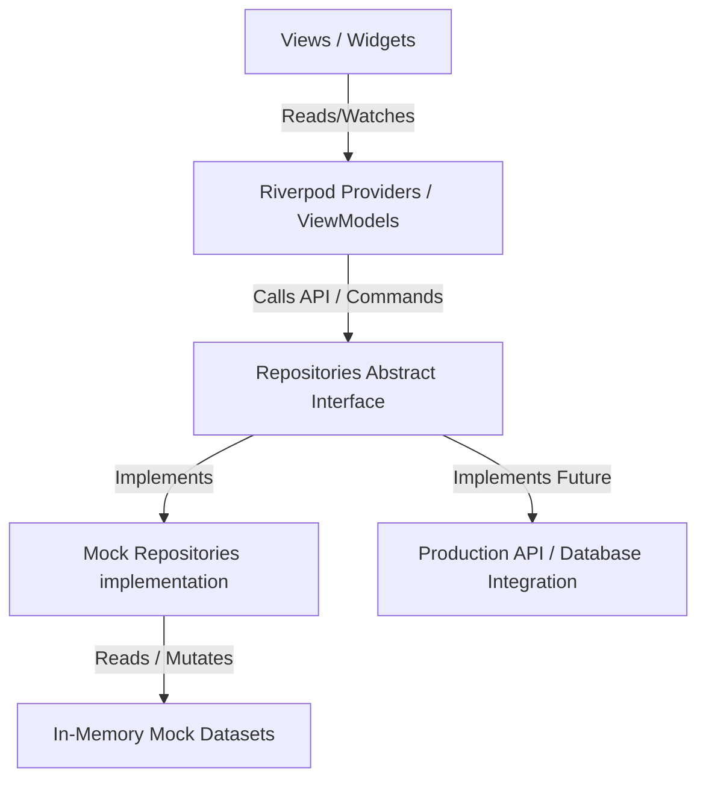

# Meetly - Architectural Blueprints

Meetly is built with a highly structured, decoupled **MVVM (Model-View-ViewModel)** architecture that separates the UI presentation from the data sourcing layer.

## 🏗️ Clean Separation Layers



### 1. Presentation Layer (Views)
* Standard widgets and stateful/stateless widgets located in `lib/features/`.
* ConsumerWidgets listen reactively to Riverpod providers (`ref.watch`) and dispatch user events/intents (`ref.read`).
* **Zero direct coupling**: Views never read mock datasets or modify local data lists directly. This prevents widget pollution and simplifies layout updates.

### 2. ViewModel / State Manager (Riverpod)
* Mediates between repository APIs and UI elements.
* Providers are declared globally or grouped inside repository files.
* Includes family providers for parametrizing datasets (e.g. `providerServicesProvider(providerId)`, `userBookingsProvider((userId: id, role: role))`).

### 3. Data Repository Layer (Decoupled Sourcing)
* Abstract interfaces declare operational signatures (e.g., `BookingRepository`, `ReviewRepository`).
* Mock implementations (e.g., `MockBookingRepository`) run in-memory, seeding datasets upon creation, adding network latency simulation (`Future.delayed`), and caching state changes in-memory.
* **Production ready**: By hot-swapping provider factories to point to REST API repositories instead of Mock implementations, the entire platform connects to a real server without modifying a single line of feature widgets.

---

## 📂 Project Directory Structure

```
lib/
├── app/
│   ├── router.dart          # GoRouter declarations & mappings
│   └── theme/               # Color palettes, dimensions, and styling tokens
├── core/
│   ├── models/              # Domain models (AppUser, Booking, Review, etc.)
│   └── widgets/             # Reusable UI cards, buttons, status badges, skeletons
├── data/
│   ├── mock/                # Seeded mock datasets (30+ pros, reviews, messages)
│   └── repositories/        # Abstract interfaces & mock repository implementations
└── features/
    ├── admin_portal/        # Admin overview stats, auditing, category configuration
    ├── auth/                # Login, Signup, Onboarding screens
    ├── bookings/            # Wizard stepper, history timelines, details
    ├── chat/                # Real-time conversations thread lists, speech bubbles
    ├── favorites/           # Locally saved pro favorites
    ├── home/                # Responsive customer dashboards, category chips
    ├── notifications/       # User alert trays
    ├── provider_portal/     # Pro dashboard progress, schedule builders, profile edit
    ├── providers/           # Public customer-facing pro profile pages
    ├── search/              # Filters, sorting, and custom vector search map
    └── splash/              # Boot timer splash screen
```

## 🔄 State Synchronization flows
* **Booking updates**: When a professional updates a job status, it writes back to `MockBookingRepository`. The dashboard calls `ref.invalidate(userBookingsProvider)` which pushes the changes reactively to both the provider workspace and the customer details timelines immediately.
* **Real-time Chat**: Tapping "Send" adds a message to `MockMessageRepository` and invalidates the thread provider. If the recipient is a provider profile, a background delay (2 seconds) triggers a simulated provider reply message and throws a client notification tray item.
